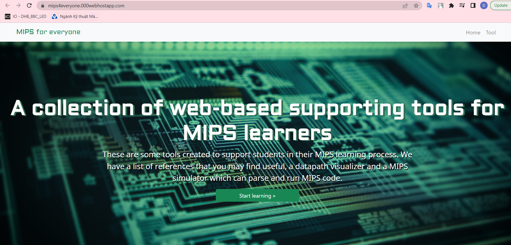

# LogicDesignWebProject 
## Introduction:
Nowadays,MIPS has become an powerful language that support the student to interact with Computer Architecture.
Therefore,we have made an website so that can help students to understand deeper about this subject.
## Preview the project :
There are 2 ways to see our project:
We have hosted it online by using the hosting page [000webhost](https://vn.000webhost.com/). 

## How is this website work:
### Frontend:
### Backend:
